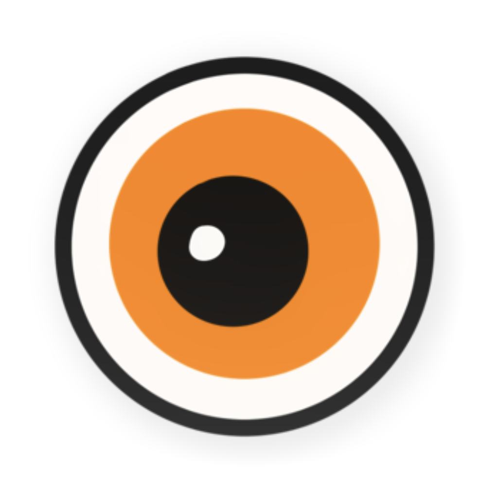
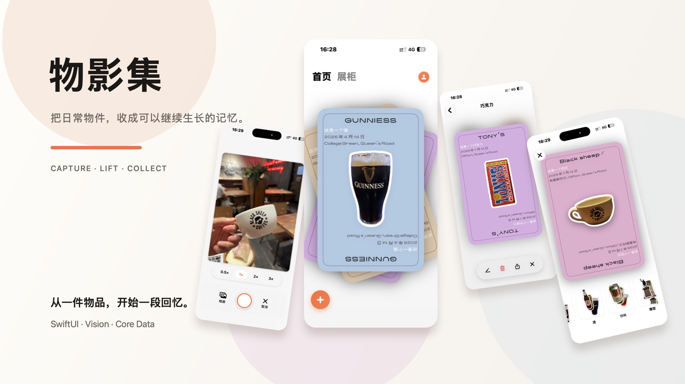

  

<h1 align="center">Hi, I'm Himi.</h1>

  Indie maker building thoughtful tools for language, health, and human agency. 
  Currently creating <strong>物影集</strong>, <strong>三分熟字幕 / Sublur</strong>, and <strong>Human OS</strong>.

  <a href="https://sublur.top">Website</a>
  ·
  <a href="https://github.com/HIMISGOOD/sublur.github.io">Product</a>
  ·
  <a href="https://github.com/HIMISGOOD/human-os">Human OS</a>
  ·
  <a href="https://chromewebstore.google.com/detail/ialajinbcabkjompgcbedlbbaknbfjki">Chrome</a>
  ·
  <a href="https://microsoftedge.microsoft.com/addons/detail/moflmmdclnleknmoalejnfpdiicoefjl">Edge</a>

## What I'm building

<h3>&nbsp;物影集</h3>

<strong>Turn everyday objects into a collection of memories that keeps growing.</strong>

An iOS memory-collection app that turns a captured object into a “physical shadow”, then lets it live on as a card, a shelf, and a growing personal series.

  

<table>
  <tr>
    <td width="92" align="center">
      
    </td>
    <td>
      <h3>三分熟字幕 · Sublur</h3>
      
<strong>You thought you were listening. You were reading.</strong>

      
A listening-first subtitle extension for YouTube and Bilibili. It blurs subtitles by default, then reveals them only when you ask—keeping help close without letting reading take over.

    </td>
  </tr>
</table>

<table>
  <tr>
    <td width="92" align="center">
      
    </td>
    <td>
      <h3>Human OS</h3>
      
<strong>Your body has data. Turn it into a daily decision.</strong>

      
An iPhone-first personal health agent combining HealthKit, daily conversation, and layered memory into one actionable operating plan.

      
<a href="https://github.com/HIMISGOOD/human-os">Explore the product and architecture →</a>

    </td>
  </tr>
</table>

## A few principles I care about

- Listen first; reveal when needed.
- Add useful friction without breaking the experience.
- Turn context into one useful next move.
- Keep AI actions inspectable and permission-gated.
- Build around real content people already love.
- Ship small, observe honestly, and keep refining.

  真正的沉浸，是听懂，而非看懂。

